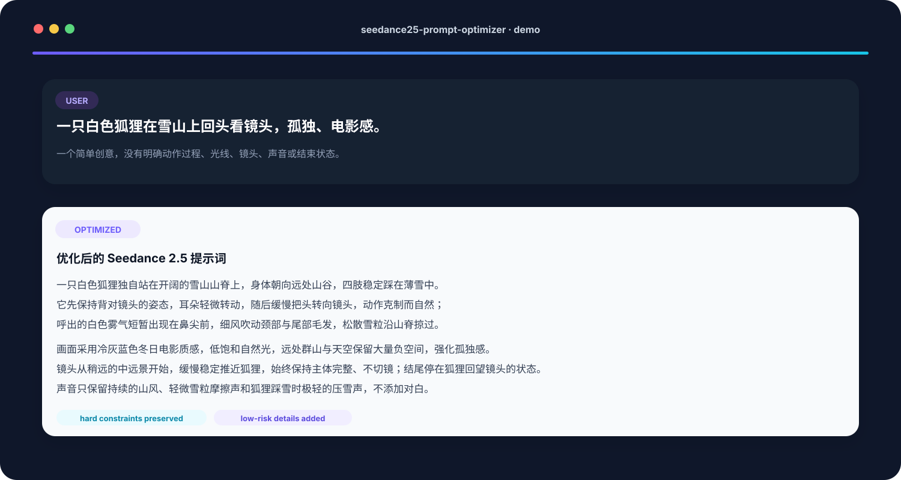
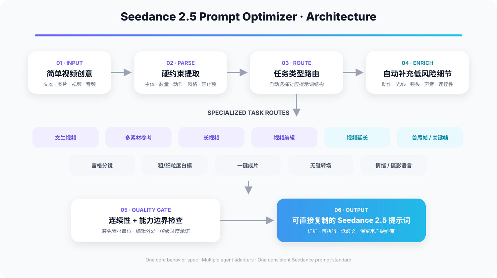

<div align="center">
  
</div>

<p align="center">
  <strong>Turn a rough video idea into a detailed, executable, copy-ready Seedance 2.5 prompt.</strong>
</p>

<p align="center">
  <a href="./README.md">简体中文</a> · English
</p>

<p align="center">
  <code>Codex</code> · <code>Claude Code</code> · <code>Cursor</code> · <code>Dify</code> · <code>Coze</code> · <code>Generic Agents</code>
</p>

> **Unofficial community project.** This repository is not affiliated with or endorsed by ByteDance, Jimeng, Seedance, OpenAI, Anthropic, Cursor, Dify, or Coze.

## What problem does it solve?

Weak video prompts are often not “too short”; they are **not executable enough**. Actions are underspecified, camera intent is vague, emotions are abstract, reference assets are poorly mapped, or state continuity is missing.

Seedance 2.5 Prompt Optimizer converts a rough idea into instructions that are:

- **Visible** — subjects, actions, state changes, and emotions have observable manifestations.
- **Audible** — dialogue, ambience, effects, and music have clear roles.
- **Sequential** — longer videos are organized by stages and end states.
- **Continuity-safe** — identity, count, props, spatial directions, and reference bindings are kept stable.
- **Conservative about invention** — it adds low-risk video details without inventing brands, critical dialogue, exact subtitles, identities, or product specifications.

## Quick demo

<div align="center">
  
</div>

### Input → output example

**Input:**

```text
A white fox on a snowy mountain turns back toward the camera. Lonely, cinematic.
```

**Optimized direction:**

```text
A single white fox stands alone on an open snow-covered mountain ridge, its body initially facing the distant valley with all four paws planted steadily in thin snow. It first holds the away-facing pose, its ears making a small reactive turn, then slowly turns its head toward the camera in a restrained, natural motion. A brief cloud of breath appears in front of its nose; light wind moves the fur around its neck and tail, while loose snow particles skim across the ridge.

Use a cold blue-gray winter cinematic look with low-saturation natural light. Keep generous negative space in the distant mountains and sky to reinforce the sense of isolation. Begin from a slightly distant medium-long shot and make a slow, stable push toward the fox without cutting; end with the fox holding its backward glance toward the camera.

Keep only mountain wind, subtle snow-particle friction, and very soft snow compression under the fox's paws. No dialogue.
```

The added detail has a job: it clarifies action progression, environmental motion, light/material response, camera execution, sound design, observable emotion, and final state continuity.

## Architecture

<div align="center">
  
</div>

```text
Rough idea / reference media
        ↓
Extract hard constraints
        ↓
Detect Seedance task type
        ↓
Route to a specialized template
        ↓
Add low-risk video-relevant details
        ↓
Continuity + capability checks
        ↓
Copy-ready final prompt
```

## Platform support

| Platform | Integration | Entry | Status |
|---|---|---|---|
| Codex | Agent Skills | root `SKILL.md` | ✅ Native |
| Claude Code | Agent Skills | root `SKILL.md` | ✅ Native |
| Cursor | Project Rule | `platforms/cursor/.cursor/rules/seedance25-prompt-optimizer.mdc` | ✅ Native rule |
| Cursor | Command | `platforms/cursor/.cursor/commands/seedance25-optimize.md` | ✅ Optional |
| Dify | System Prompt | `platforms/dify/system-prompt.md` | ✅ Prompt adapter |
| Coze / Coze Studio | Agent Prompt | `platforms/coze/agent-prompt.md` | ✅ Prompt adapter |
| Other agents | System Prompt | `platforms/generic/system-prompt.md` | ✅ Generic |
| Reuse / porting | Structured instruction | `instructions/seedance25-structured-instruction.zh-CN.md` | ✅ Full spec |

Different platforms expose different extension surfaces, so the repository uses each platform's real integration mechanism instead of pretending every platform installs the same `SKILL.md` format.

## Capabilities

- Preserves explicit user constraints: subjects, counts, story events, style, camera, sound, references, and exclusions.
- Adds low-risk action, environment, lighting/material, camera, sound, and continuity details.
- Turns abstract emotions into observable eye movement, facial expression, breathing, gaze, and body behavior.
- Routes complex tasks to specialized structures instead of forcing everything into one generic prompt.
- Maps `@image / @video / @audio` responsibilities in multi-reference tasks.
- Organizes long videos by stages and observable end states.
- Keeps video edits scoped to a unique master, target range, unchanged content, and inherited timing.
- Strengthens boundary continuity for extension, keyframe, and transition tasks.
- Avoids claiming frame-perfect editing, pixel-identical generation, or guaranteed exact generated text.

## Supported Seedance 2.5 task families

1. Text-to-video
2. Multi-image / video / audio reference
3. 30-second or multi-stage long video
4. Video editing
5. Forward / backward extension
6. First-frame / first-last-frame generation
7. Multi-keyframe sequencing
8. Storyboard / shot-grid prompting
9. Coarse blockout reference
10. Fine blockout re-rendering
11. Auto-movie / one-click assembly
12. Seamless transitions between two videos

## Installation

### Codex

```bash
mkdir -p "$HOME/.agents/skills"
git clone https://github.com/gutouy/seedance25-prompt-optimizer.git \
  "$HOME/.agents/skills/seedance25-prompt-optimizer"
```

Explicit invocation:

```text
$seedance25-prompt-optimizer Optimize this Seedance 2.5 idea: a white fox on a snowy ridge turns toward camera, lonely and cinematic.
```

### Claude Code

```bash
mkdir -p "$HOME/.claude/skills"
git clone https://github.com/gutouy/seedance25-prompt-optimizer.git \
  "$HOME/.claude/skills/seedance25-prompt-optimizer"
```

```text
/seedance25-prompt-optimizer Optimize this video idea: ...
```

See [`platforms/claude-code/README.md`](./platforms/claude-code/README.md).

### Cursor

Copy [`platforms/cursor/.cursor`](./platforms/cursor/.cursor) into your project root, then use the project rule or the optional command:

```text
@seedance25-prompt-optimizer Optimize this Seedance 2.5 prompt: ...
```

```text
/seedance25-optimize
```

See [`platforms/cursor/README.md`](./platforms/cursor/README.md).

### Dify

Copy:

```text
platforms/dify/system-prompt.md
```

into the System Prompt of your Dify app, agent, or LLM node. This adapter is self-contained.

See [`platforms/dify/README.md`](./platforms/dify/README.md).

### Coze / Coze Studio

Copy:

```text
platforms/coze/agent-prompt.md
```

into the agent Prompt / Instruction area or reuse it as a prompt resource.

See [`platforms/coze/README.md`](./platforms/coze/README.md).

### Other agent builders

Use:

```text
platforms/generic/system-prompt.md
```

For the complete reusable behavior specification, see [`instructions/seedance25-structured-instruction.zh-CN.md`](./instructions/seedance25-structured-instruction.zh-CN.md).

## Design principles

**Detail is functional, not decorative.** Every added detail should clarify subject, action, environment, camera, sound, emotion, continuity, material binding, or edit scope.

**Enrich conservatively.** Add low-risk details that make the video easier to generate, but do not overwrite the user's core creative intent.

**Route before expanding.** Multi-reference, long-video, editing, extension, keyframe, blockout, and transition tasks use specialized structures.

**One behavior spec, multiple adapters.** `SKILL.md`, the structured instruction, and platform adapters share the same core behavior while changing only installation and invocation mechanics.

## Repository structure

```text
seedance25-prompt-optimizer/
├── assets/                           # Logo, architecture, usage demo
├── SKILL.md                          # Canonical Agent Skill (Codex / Claude Code)
├── README.md                         # Chinese documentation
├── README.en.md                      # English documentation
├── LICENSE
├── CHANGELOG.md
├── agents/
├── references/
├── instructions/
├── platforms/
└── docs/
```

## Contributing

Issues and pull requests are welcome for:

- new Seedance 2.5 task templates,
- more stable camera/action/continuity patterns,
- failure cases and corrective rules,
- Chinese and English examples,
- Claude Code / Cursor / Dify / Coze adapters,
- additional Agent Skill / Rule / Prompt targets.

Prefer rules that are executable, observable, and low-ambiguity rather than adjective-heavy.

## Disclaimer

This is an unofficial community tool. Model capabilities, product parameters, platform formats, and agent configuration mechanisms may change over time.

The repository does not redistribute the original long-form Seedance prompt guide. Its core rules have been reorganized and engineered into a prompt-optimization workflow.

## License

MIT License. See [`LICENSE`](./LICENSE).
